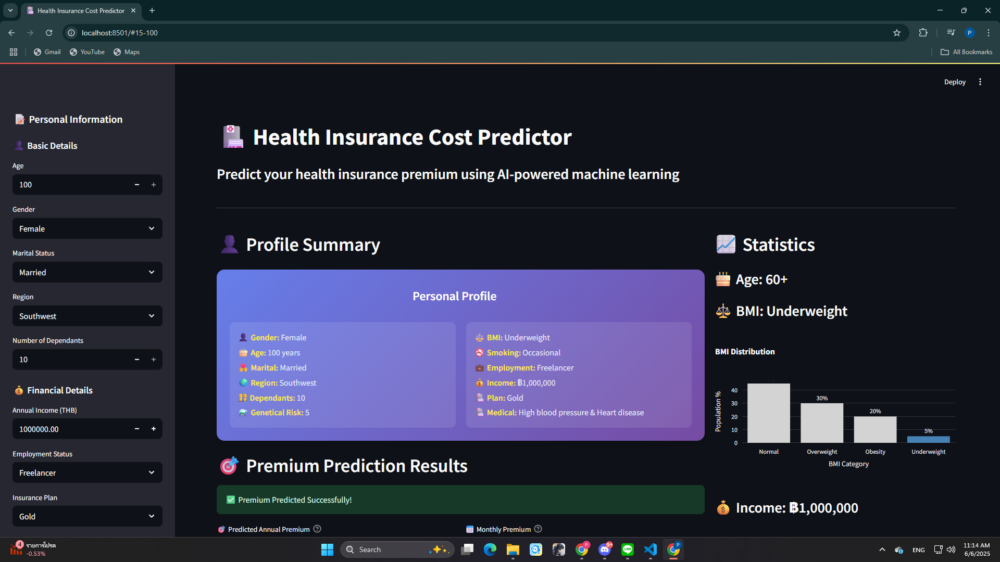
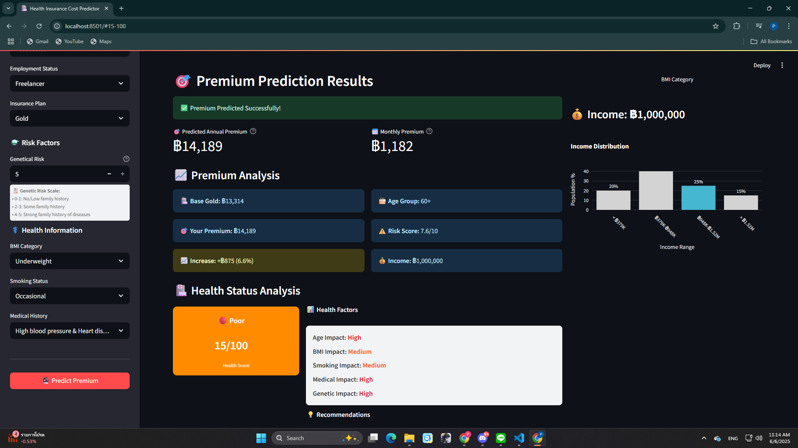

# 🏥 Healthcare Premium Prediction

This project is a Streamlit web application designed to predict healthcare insurance premiums based on personal, financial, and health details. The application uses machine learning models—one for young adults (≤25 years) and one for adults (>25 years)—to estimate premiums and applies an explicit insurance plan multiplier to adjust the predicted price accordingly.

## 📸 Screenshots

<div align="center">

**Main Dashboard**  


**Prediction Results**  


</div>

## 📁 Project Structure

```
healthcare-premium-prediction/
├── app/
│   ├── main.py                     # Main Streamlit application entry point with UI and visualization code
│   ├── prediction_helper.py        # ML model loading, input preprocessing, prediction logic, and risk scoring
|   └── artifact/
│       ├── model_young.joblib          # ML model for young adults (≤25)
│       ├── model_rest.joblib           # ML model for adults (>25)
│       ├── scaler_young.joblib         # Data scaler for young adults
│       └── scaler_rest.joblib          # Data scaler for adults
|
├── images/
|   ├── app-interface-1.png     # Main dashboard
│   └── app-interface-2.png     # Prediction results
|
├── requirements.txt    # Project dependencies
├── README.md           # Project documentation

```

## ✨ Features

### 🎯 **Premium Prediction**
- Utilizes age-specific ML models for estimating insurance premiums.
- Applies an explicit insurance plan multiplier (e.g. Bronze, Silver, Gold) to adjust the final premium.
- Confidence scoring along with fallback calculations if the ML model fails.
  
### 💱 **Currency Conversion**
- **Income Input**: THB is converted to Lakhs INR (1 Lakh INR = ฿37,900).
- **Premium Display**: Final predictions in INR are converted to THB (₹1 INR = ฿0.3804) for display.

### 🏥 **Health Assessment**
- Calculates a comprehensive risk score based on age, BMI, smoking status, medical history, and genetic factors.
- Provides personalized health recommendations and categorizes health status (Excellent/Good/Fair/Poor).

### 📊 **Interactive Visualizations**
- Real-time charts for BMI and income distributions with user highlighting.
- Detailed premium breakdown analysis comparing base plan costs with the predicted premium.

### 🎨 **User Interface**
- Responsive sidebar input forms.
- Gradient profile summary cards with color-coded health indicators.
- Seamless integration between data input, model prediction, and visualization.

## 🔄 Application Workflow

1. **Input Collection**: Users enter personal, financial, and health details via the sidebar.
2. **Data Preprocessing**: Application converts income from THB to Lakhs INR, scales features, and prepares input for prediction.
3. **ML Prediction**: Depending on the age group, either the young adult or adult model is used. An insurance plan multiplier (e.g., Bronze = 1.0, Silver = 1.15, Gold = 1.30) is applied to adjust the predicted premium.
4. **Results Display**: Outputs include the predicted annual and monthly premiums (in THB), along with a detailed premium analysis.
5. **Visualization**: Interactive charts display the prediction context and health evaluation.

## 🚀 Setup Instructions

### Prerequisites
- Python 3.8 or higher
- pip package manager

### Installation

1. **Clone the repository:**
   ```bash
   git clone <repository-url>
   cd "Machine Learning/Healthcare Premium Prediction/project_1_datacleaning_&_EDA_resources"
   ```

2. **Install dependencies:**
   ```bash
   pip install -r app/requirements.txt
   ```

3. **Verify ML models exist:**
   ```bash
   # Ensure these files exist in artifact/ directory:
   # - model_young.joblib
   # - model_rest.joblib  
   # - scaler_young.joblib
   # - scaler_rest.joblib
   ```

4. **Run the application:**
   ```bash
   streamlit run app/main.py
   ```

5. **Access the application:**
   - Open your browser and navigate to `http://localhost:8501`

## 📖 Usage Guidelines

### Input Parameters

**👤 Personal Information:**
- Age (18-100 years)
- Gender (Male/Female)
- Marital Status (Married/Unmarried)
- Region (Northeast, Northwest, Southeast, Southwest)
- Number of Dependants (0-10)

**💰 Financial Details:**
- Annual Income in THB (minimum ฿37,900)
- Employment Status (Salaried / Self-Employed / Freelancer)
- Insurance Plan (Bronze, Silver, Gold)

**⚗️ Risk Factors:**
- Genetical Risk (0-5 scale)
- Medical History (various conditions available)

**⚕️ Health Information:**
- BMI Category (Normal/Overweight/Obesity/Underweight)
- Smoking Status (No Smoking/Occasional/Regular)

### Output Information

**🎯 Premium Results:**
- **Predicted Annual Premium** (in THB) and **Monthly Premium** (derived as annual/12)
- **Risk Score** (0-10 scale) based on multiple health factors
- Confidence score provided by the ML model

**📈 Premium Analysis:**
- Comparison between the base premium and the AI-predicted premium after applying the insurance plan multiplier.
- Detailed breakdown including age group, income category, and risk factors.

## 💻 Code Structure and Functions

### Main Application Functions
```python
def convert_inr_to_thb(inr_amount):
    """Convert Indian Rupees to Thai Baht for premium display"""
    return inr_amount * 0.3804
```

### Data Processing Functions
```python
def preprocess_input(data):
    """Prepare user input for ML prediction, including scaling and encoding"""
    # Includes currency conversion and feature scaling
```

### ML Prediction Flow
```python
# 1. Load and preprocess data
# 2. Select the model based on age
# 3. Predict premium in INR and apply insurance plan multiplier
# 4. Convert the final prediction to THB and return the result
```

## 📦 Dependencies

- **streamlit**: for building the web application
- **pandas**: for data manipulation
- **numpy**: for numerical operations
- **plotly**: for interactive visualizations
- **scikit-learn**: for machine learning algorithms
- **joblib**: for model serialization and loading

---

**⚠️ Disclaimer**: The predictions are estimates based on machine learning models and currency conversion constants. Actual insurance premiums may vary based on additional factors not considered in this model.
